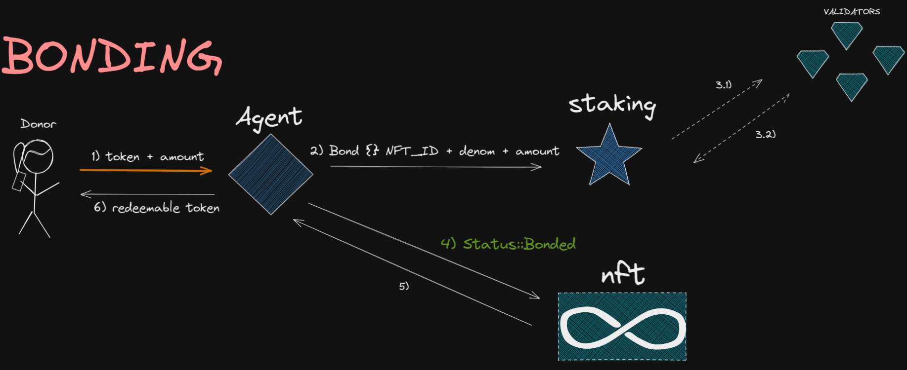
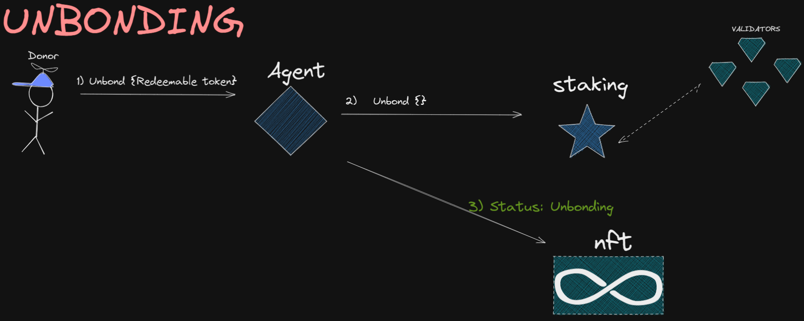
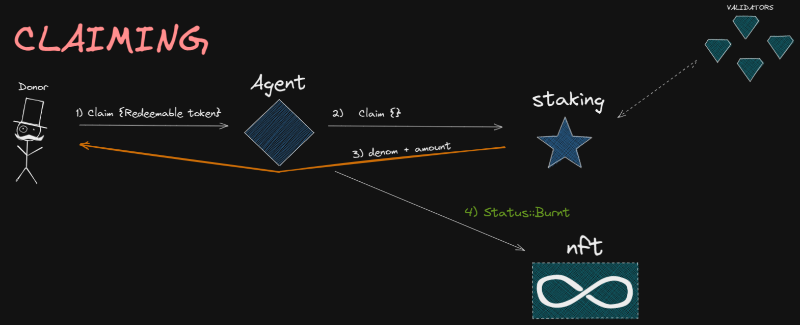
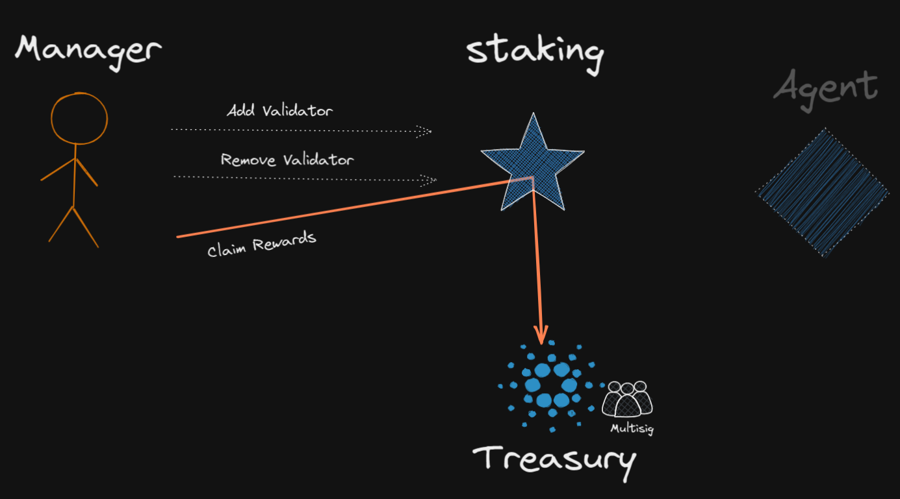

# Angel Staking

These set of contracts will stake funds from users and collect the staken rewards to then divide to different charities.

>While the funds are staked the users will receive an NFT as proof of donation. 
    
>That NFT is mutable in order to be able to accept more donations from the same user and keep track of the donation status.

A donation at any moment in time can be **bonded, unbonding or claimed**.

It is comprised of three contracts:
- **Agent**: Arbiter in the process of bonding, unbonding and claiming.
- **NFT**: Creates and updates nft metadata.
- **Staking**: Gets funds from users and handles the staking process. The validator set can be updated at any moment and depending on its number, the contract adapts its logic.

The **agent** contract *on instantiation* will itself instantiate the **nft** and **staking** contract. It will also define a number of **actors** in the model:

- **manager**: add/remove validators, claim rewards.
- **treasury**: account receiving rewards. On current implementation on Juno Testnet it is a multisig contract.
- **admin**: update contracts versions.

## Actor model

These contracts rely on the actor model to handle any of the user interactions, meaning that any flow defined on this contract will be either be committed in full or rollbacked completely facing any errors.

## Deployment on Juno Testnet

- **Agent**: juno1xc0s9lzk82sj9x6sr3rwgrvtlp7329laseu6s8qqueste0jeshkqf7j8xf
- **NFT**: juno1k6we36nauhc85tulnv9pkg65y3hak3u8fclwq260x00cw3m835gssljrdp
- **Staking**: juno1zpz0clkuppa5f7gmu7g70nszanee4sy9dzy6fahmyfgfj5e23tzqlvjzj0
